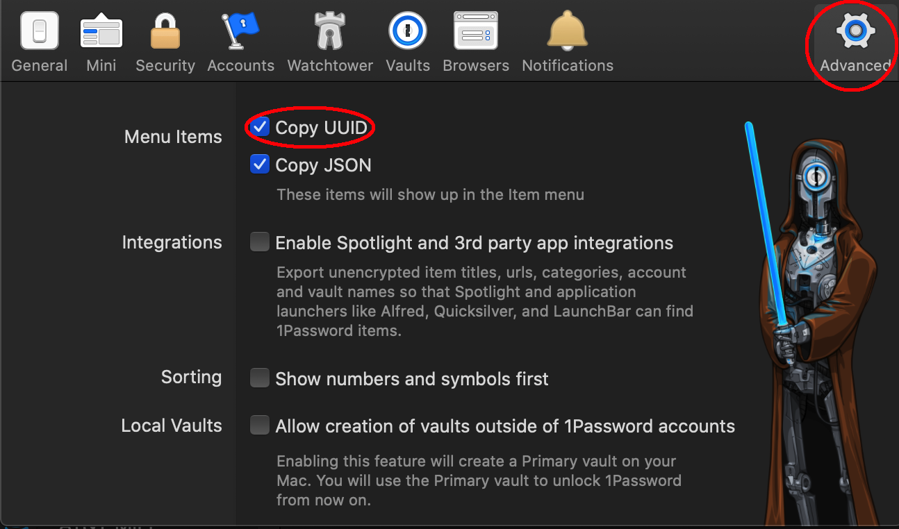

CMS VPN logger-inner
======================

.. image:: https://img.shields.io/badge/license-Apache%202.0-informational
   :target: https://www.apache.org/licenses/LICENSE-2.0.txt
   :alt: LICENSE

.. image:: https://img.shields.io/badge/code%20style-black-000000.svg
   :target: https://github.com/psf/black
   :alt: STYLE

.. image:: https://img.shields.io/circleci/build/gh/trussworks/cmslogin
   :target: https://circleci.com/gh/trussworks/cmslogin/tree/master
   :alt: CIRCLECI

Helps logging in to the CMS VPN via openconnect-tinyproxy: https://github.com/trussworks/openconnect-tinyproxy

Installation
------------

You need 1Password-cli:

.. code-block:: console

    brew install 1password-cli

Download the latest release and install with pip:

.. code-block:: console

    pip3 install cmslogin-0.1.0.tar.gz

You need the openconnect-tinyproxy on disk.

Setup
-----

If this is your first time running 1password-cli, you may have to do an
explicit login to create a local configuration:

.. code-block:: console
   $ op signin trussworks.1password.com ryan@truss.works

In 1Password, enable the option to copy a record's UUID in Preferences → Advanced → Copy UUID:

With that set, find the record that has your password and TOTP for the VPN.
Right click, and in the context menu choose "Copy UUID".

Usage
-----
Now you can run the script by passing the path to the tinyproxy followed by the UUID:

.. code-block:: console

   $ eval "$(op signin)"
   Enter the password for ryan@truss.works at truss.1password.com:
   $ cmslogin ~/src/truss/works/openconnect-tinyproxy/ rsfq7iycufda7m5acghwyodapq
   Spawning child process
   waiting for username prompt...
   sending username
   waiting for password prompt...
   sending password
   waiting for totp prompt...
   fetching totp
   sending totp
   finished, switching to interactive

   POST https://cloudvpn.cms.gov/
   Got CONNECT response: HTTP/1.1 200 OK
   CSTP connected. DPD 30, Keepalive 20
   Connected as 10.232.43.156, using SSL, with DTLS in progress
   Established DTLS connection (using OpenSSL). Ciphersuite ECDHE-ECDSA-AES256-GCM-SHA384.
   Connect Banner:
   | *        You are accessing a U.S. Government information system.          *
   | *      UNAUTHORIZED ACCESS OR USE OF THIS COMPUTER        *
   | *                        SYSTEM IS PROHIBITED BY LAW                            *
   | By clicking Accept, you authorize the U.S. Government to monitor, intercept, and search and seize any communication or data transiting or stored on this information system. Any communication or data transiting or stored on this information system may be disclosed or used for any lawful U.S. Government purpose.
   | ********************************    WARNING    ********************************
   |

Once it's working, you may want to automate this with a shell script.

Development
-----------

You need pre-commit and poetry:

.. code-block:: console

   brew install poetry ; brew install pre-commit

Inside the project directory you can enter a virtual environment like so:

.. code-block:: console

   poetry shell
